# GILM: Grid-Indexed Localization with Multimodal Models
## An Innovative Approach for Robust and Provider-Agnostic Object Detection

> **Author:** Alessandro Ciciarelli  
> **Affiliation:** [IntelligenzaArtificialeItalia.net](https://intelligenzaartificialeitalia.net)  
> **Date:** August 2025  
> **License:** AGPL-3.0-or-later  
> **Version:** 1.0  

[](README.md)
[](https://github.com/your-username/GILM-simple)
[](LICENSE)

---

## Abstract

Vision-Language Models (LLMs) excel at semantic image interpretation but show critical instability in precise object localization, generating inconsistent metric coordinates across multiple executions. GILM introduces an innovative paradigm that delegates exclusively semantic decisions to models while maintaining all geometric transformations deterministic system-side. Through an indexed grid overlaid on the image, GILM achieves robust localization with any LLM provider, demonstrating performance **equivalent to Gemini 2.5's spatial understanding** on common objects and **superior on specialized domains** where traditional methods fail.

**Main contributions:**
- Provider-agnostic methodology for object detection with arbitrary LLMs
- Elimination of spatial drift through discrete coordinates  
- Zero-dependency modular architecture for immediate deployment
- Empirical validation on daily-object and domain-expert scenarios

---

## 1. Introduction and Motivation

### 1.1 Localization Problem in LLMs

Contemporary multimodal models (GPT-4.1-mini, Claude 3.7, Gemini 2.5) demonstrate excellent visual understanding capabilities but suffer from **geometric instability** in object localization. Recurring issues include:

- **Spatial drift**: Variance σ² > 15% in coordinates between identical runs
- **Format inconsistency**: Mix of normalized coordinates, pixels, percentages  
- **Provider dependency**: Only Gemini supports native spatial understanding
- **Domain limitation**: Critical failure on specialized objects

### 1.2 State of the Art

**Traditional approaches:**
- **Direct prompting**: "Provide bounding boxes for objects X"  
  ❌ High variance, inconsistent format
- **Spatial understanding** (Gemini 2.5): Native coordinates  
  ❌ Limited to one provider, fails on expert domains
- **Specific fine-tuning**: Model adaptation  
  ❌ Prohibitive costs, loss of generalization

### 1.3 GILM Contribution

GILM resolves instability through **semantic-geometric separation**:

```
Traditional: LLM → [unstable metric coordinates]
GILM:        LLM → [semantic cells] → [deterministic coordinates]
```

---

## 2. Methodology

### 2.1 GILM Architecture

The GILM system operates through four sequential phases:

```mermaid
graph TD
    A[Input Image I] --> B[Grid Overlay G]
    B --> C[Structured Prompt P] 
    C --> D[LLM Provider Π]
    D --> E[Semantic Parsing]
    E --> F[Geometric Mapping]
    F --> G[Bounding Boxes B]
```



#### **Phase 1: Grid Overlay**

Given an image I ∈ ℝ^(H×W×3), we generate a grid G of dimensions R×C:

```
G(r,c) = {
  label: letterSequence(c) + str(r+1),  // A1, B2, ..., AA1
  bounds: [(c·W/C, r·H/R), ((c+1)·W/C, (r+1)·H/R)]
}
```

where `letterSequence(n)` maps numbers to alphabetic sequences (A, B, ..., Z, AA, AB, ...).

#### **Phase 2: Semantic Prompt**

Prompt P is structured to request identification of contiguous cells:

```json
{
  "areas": [
    {
      "cells": ["B3","B4","C4"],  // Contiguous cells
      "label": "object-class",     // Semantic class  
      "score": 0.85,              // Confidence [0,1]
      "explanation": "rationale"   // Justification
    }
  ],
  "no_detections": false
}
```

#### **Phase 3: Deterministic Mapping**

From semantic cells S = {s₁, s₂, ..., sₖ} to bounding box B:

```
rect(S) = {
  x_min = min(cell.x for cell in S)
  y_min = min(cell.y for cell in S)  
  x_max = max(cell.x + cell.w for cell in S)
  y_max = max(cell.y + cell.h for cell in S)
}

B = applyPadding(rect(S), padRatio)
```

### 2.2 Theoretical Advantages

**Variance Elimination:** Discrete coordinates eliminate continuous uncertainty:
```
Var(coords_traditional) = σ²_spatial + σ²_model  
Var(coords_GILM) = 0 + σ²_semantic ≪ σ²_spatial
```

**Provider Agnostic:** Any LLM Π with multimodal capabilities:
```
GILM(I, Π) → B  ∀Π ∈ {GPT-4.1-mini, Claude-3.7, Gemini-2.5, ...}
```

---

## 3. Implementation

### 3.1 Modular Architecture

```javascript
// Grid Module: Grid generation and rendering
GILMGrid.composeGrid(image, {rows, cols}) → gridImage

// Providers Module: Multimodal adapters  
GILMProviders.createProvider(type, {apiKey, model}) → provider

// Core Module: End-to-end orchestration
GILMCore.analyzeWithGrid(provider, options) → results
```

### 3.2 Supported Providers

| Provider | Default Model | API Endpoint | Cost/1K img |
|----------|----------------|--------------|---------------|
| **OpenAI** | GPT-4o-mini | Chat Completions | ~$2-4 |
| **Anthropic** | Claude-3.7-Sonnet | Messages API | ~$3-6 |  
| **Google** | Gemini-2.5-Flash | generateContent | ~$1-2 |

### 3.3 Optimal Configuration

**Adaptive grid:**
```javascript
const gridSize = Math.ceil(Math.sqrt(expectedObjects) * 1.5);
const config = {
  rows: Math.min(gridSize, 16),
  cols: Math.min(gridSize, 16), 
  padRatio: 0.02  // 2% padding
};
```

---

## 4. Experimental Validation

### 4.1 Dataset and Metrics

**Tested scenarios:**
- **Daily Objects**: Cars, boats, people (common objects)
- **Domain Expert**: Welding, hardware components (specialized objects)

**Metrics:**
- **mIoU**: Mean Intersection over Union with ground truth
- **Precision@0.5**: Percentage detection with IoU > 0.5  
- **Consistency**: Variance across multiple runs
- **Provider Coverage**: Cross-provider functionality

### 4.2 Daily Objects Results

**Scenario: Car detection**

| Method | Provider | mIoU | Precision@0.5 | Consistency |
|--------|----------|------|---------------|-------------|
| Spatial Understanding | Gemini 2.5 | **0.84** | **0.92** | 0.95 |
| **GILM** | Gemini 2.5 | **0.82** | **0.89** | **0.98** |
| **GILM** | GPT-4o-mini | **0.79** | **0.85** | **0.97** |
| Direct Prompting | GPT-4o-mini | 0.45 | 0.51 | 0.23 |


*Figure 1: Spatial understanding vs GILM comparison on car detection*

  
*Figure 2: GILM with GPT-4o-mini - first use for bounding boxes*

**Scenario: Boat detection**


*Figure 3: GILM on boat detection - precision on irregular objects*

### 4.3 Domain Expert Results

**Scenario: Welding analysis (cracks)**

| Method | Provider | mIoU | Precision@0.5 | Detection Rate |
|--------|----------|------|---------------|----------------|
| Spatial Understanding | Gemini 2.5 | 0.31 | 0.28 | **Failure** |
| **GILM** | Gemini 2.5 | **0.87** | **0.91** | **Success** |
| **GILM** | GPT-4o-mini | **0.82** | **0.86** | **Success** |


*Figure 4: GILM on welding cracks - domain where traditional methods fail*

**Scenario: Hardware components**


*Figure 5: Comparison on specialized hardware components*


*Figure 6: GILM + GPT-4o-mini on hardware - extending capabilities beyond native providers*

### 4.4 Results Analysis

**Daily Objects: Competitive parity**
- GILM achieves performance **equivalent** to native spatial understanding
- **Consistency advantage**: 98% vs 95% stability across runs
- **Cross-provider enablement**: GPT-4o-mini now usable for bounding boxes

**Domain Expert: Clear superiority**  
- **Dramatic improvement**: mIoU from 0.31 to 0.87 (+180%)
- **Robustness**: Works consistently where traditional methods fail
- **Provider versatility**: Same performance with different models

---

## 5. Discussion and Limitations

### 5.1 Strengths

✅ **Spatial drift elimination**: Deterministic coordinates  
✅ **Provider agnostic**: Works with any multimodal LLM  
✅ **Domain expert superiority**: Excels where other approaches fail  
✅ **Zero dependencies**: Immediate deployment without installations  
✅ **Open source**: Complete transparency and modifiability

### 5.2 Limitations

⚠️ **Fixed granularity**: Resolution limited by grid  
⚠️ **Small objects**: Require dense grids for optimal accuracy  
⚠️ **Label readability**: Depends on grid rendering quality

### 5.3 Future Improvements

**V2.0 Roadmap:**
- **Adaptive grids**: Variable resolution based on content
- **Multi-scale analysis**: Hierarchical grid for different object scales  
- **Active learning**: Iterative refinement based on feedback
- **Performance optimization**: WebGL rendering for complex grids

---

## 6. Conclusions

GILM demonstrates that **semantic-geometric separation** effectively resolves LLM instability in object localization. Empirical results confirm:

1. **Parity on daily objects** with native spatial understanding  
2. **Superiority on domain expert** where traditional approaches fail
3. **Provider-agnostic enablement** for robust object detection

The approach opens new possibilities for using models like GPT-4o-mini in computer vision scenarios previously inaccessible, democratizing advanced object detection.

**Practical impact:**
- Developers can use any LLM provider for bounding boxes
- Specialized domains finally get reliable localization  
- Reduced costs through cheaper models (GPT-4o-mini vs GPT-4.1-mini)

---

## 7. References and Reproducibility

### 7.1 Source Code

```bash
git clone https://github.com/your-username/GILM-simple.git
cd GILM-simple
# Open index.html and test with your images
```

### 7.2 Practical Examples

**Quick Start:**
```javascript
// Create provider
const provider = GILMProviders.createProvider('openai', {
  apiKey: 'sk-...',
  model: 'gpt-4o-mini'  // Now supported for bounding boxes!
});

// Analyze image
const result = await GILMCore.analyzeWithGrid(provider, {
  fileOrDataURL: imageFile,
  objects: 'cars, people',
  rows: 12, cols: 12,
  language: 'en'
});
```

### 7.3 Test Dataset

Images used in experiments are available in:
- `test-img/daily-object/`: Cars, boats, common objects
- `test-img/domain-object/`: Welding, specialized hardware

### 7.4 Recommended Configurations

| Scenario | Rows×Columns | Provider | Model |
|----------|---------------|----------|---------|
| **Large objects** | 8×8 | Any | Economical |
| **Medium objects** | 12×12 | Any | Standard |  
| **Small objects** | 16×16 | Gemini | Flash |
| **Domain expert** | 15×15 | OpenAI | GPT-4o-mini |

---

## 8. Acknowledgments

- **OpenAI, Anthropic, Google** for excellent multimodal APIs
- **Open source community** for feedback and contributions during development
- **[IntelligenzaArtificialeItalia.net](https://intelligenzaartificialeitalia.net)** for supporting AI research in Italy

---

## Citation

```bibtex
@software{ciciarelli2025gilm,
  title={GILM: Grid-Indexed Localization with Multimodal Models},
  author={Alessandro Ciciarelli},
  year={2025},
  publisher={IntelligenzaArtificialeItalia.net},
  url={https://github.com/your-username/GILM-simple},
  license={AGPL-3.0-or-later}
}
```

---

**🚀 Try GILM today and discover how to enable robust object detection with any LLM provider!**

*Developed with ❤️ by [Alessandro Ciciarelli](https://intelligenzaartificialeitalia.net) to democratize AI vision in Italy and worldwide.*